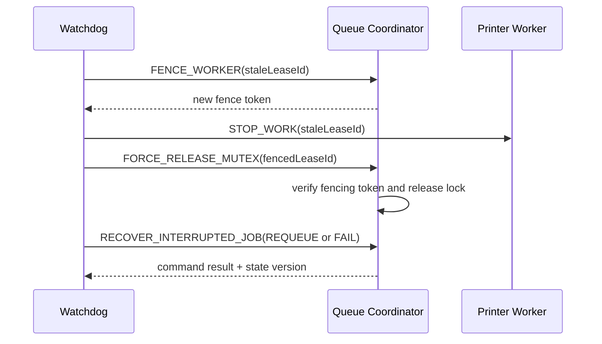

# Smart Printer Queue Management System — Agent Specifications

## 1. Purpose and operating model

This document defines the autonomous, deterministic agents that operate the Smart Printer Queue Management System. These are application services—not unconstrained generative AI. Every decision is reproducible from validated state, recorded in the audit log, and applied through the scheduling engine's command boundary.

Agents may observe events concurrently, but they never mutate the shared queue directly. They issue typed commands to the Queue Coordinator, which serializes mutations under the queue mutex. A printer state transition additionally requires ownership of that printer's mutex. This preserves the OS concepts the simulator demonstrates while preventing competing automation from corrupting state.

### 1.1 Canonical invariants

- A job has exactly one lifecycle state at any instant.
- A printer owns at most one active job, and a job is assigned to at most one printer.
- Only the Queue Coordinator can change queue membership or ordering.
- Only the printer worker holding `printer:{printerId}` may advance pages or release that printer.
- Agent commands are idempotent by `commandId`; replaying a command cannot repeat its side effect.
- Every accepted or rejected command produces an `audit.entry.created` event.
- Manual operator actions outrank automation unless a safety invariant would be violated.
- Agent decisions use a consistent scheduler revision and state version. Stale decisions are rejected with `STATE_VERSION_CONFLICT`.

## 2. Shared agent contracts

```ts
type UUID = string;
type ISODateTime = string;

type AgentName =
  | "automation-daemon"
  | "watchdog-intercept"
  | "load-balancer"
  | "starvation-guard"
  | "metrics-evaluator";

interface AgentEvent<TType extends string, TPayload> {
  eventId: UUID;
  type: TType;
  occurredAt: ISODateTime;
  correlationId: UUID;
  stateVersion: number;
  payload: TPayload;
}

interface AgentCommand<TType extends string, TPayload> {
  commandId: UUID;
  agent: AgentName;
  type: TType;
  issuedAt: ISODateTime;
  expectedStateVersion: number;
  correlationId: UUID;
  payload: TPayload;
}

interface AgentCommandResult {
  commandId: UUID;
  accepted: boolean;
  resultingStateVersion: number;
  errorCode?:
    | "STATE_VERSION_CONFLICT"
    | "INVARIANT_VIOLATION"
    | "LOCK_NOT_OWNED"
    | "CIRCUIT_OPEN"
    | "INVALID_TRANSITION";
  message?: string;
}
```

### 2.1 Permission classes

| Permission | Meaning |
|---|---|
| `QUEUE_READ` | Read immutable queue snapshots and scheduler configuration. |
| `METRICS_READ` | Read aggregate and per-job timing metrics. |
| `ISSUE_QUEUE_COMMAND` | Ask the Queue Coordinator to enqueue, reorder, pause, resume, or cancel. |
| `ISSUE_PRINTER_COMMAND` | Ask a worker to pause, recover, or release a printer. |
| `UPDATE_SCHEDULER_CONFIG` | Change algorithm or aging parameters through validated configuration. |
| `FORCE_RELEASE_MUTEX` | Recover an expired printer lease after fencing its former owner. |
| `EMIT_ALERT` | Publish a user-visible warning or incident. |

No agent receives raw database credentials, arbitrary filesystem access, shell execution, or direct access to mutex internals.

## 3. Automation Daemon

### Role and purpose

The Automation Daemon is the orchestration clock. It advances the simulated system, requests dispatch when capacity exists, expires temporary fault states, and coordinates periodic agent evaluations. It does not choose which job wins; the configured scheduler does.

### Trigger scope

- `SYSTEM_STARTED`
- `SIMULATION_TICK` at the configured interval, default `250 ms`
- `JOB_ENQUEUED`, `JOB_COMPLETED`, `JOB_CANCELLED`
- `PRINTER_READY`, `PRINTER_RECOVERED`
- operator commands `SIMULATION_PAUSED` and `SIMULATION_RESUMED`

### Permissions and mutex rights

- Permissions: `QUEUE_READ`, `ISSUE_QUEUE_COMMAND`, `ISSUE_PRINTER_COMMAND`.
- May request queue-lock acquisition through the Queue Coordinator.
- May request an idle worker to acquire its printer mutex.
- Cannot force-release a mutex, edit priority, or bypass scheduler selection.

### Inputs and outputs

```ts
type AutomationInput = AgentEvent<
  "SIMULATION_TICK",
  { tick: number; elapsedSimulationMs: number; speedMultiplier: number }
>;

type DispatchCommand = AgentCommand<
  "DISPATCH_NEXT_JOB",
  { printerId: UUID; schedulerRevision: number }
>;

type AdvanceCommand = AgentCommand<
  "ADVANCE_ACTIVE_JOB",
  { printerId: UUID; elapsedSimulationMs: number; workerLeaseId: UUID }
>;
```

| Input | Condition | Output action |
|---|---|---|
| `SIMULATION_TICK` | ready printer and non-empty ready queue | `DISPATCH_NEXT_JOB` |
| `SIMULATION_TICK` | printer is printing | `ADVANCE_ACTIVE_JOB` |
| `JOB_COMPLETED` | another job is ready | request immediate dispatch without waiting for the next tick |
| `SIMULATION_PAUSED` | always | stop advancement; retain leases and state |
| `SIMULATION_RESUMED` | always | resume ticks from persisted simulation time |

### Fail-safe and circuit breaker

- A monotonic clock prevents wall-clock changes from producing negative elapsed time.
- At most one unacknowledged command per printer is allowed.
- Three coordinator timeouts within 10 seconds open the daemon circuit for 5 seconds and emit `AUTOMATION_DEGRADED`.
- While open, no advancement occurs; state is retained and manual recovery remains available.
- On restart, the daemon loads the last committed tick and never replays already acknowledged commands.

## 4. Watchdog Intercept Agent

### Role and purpose

The Watchdog detects non-progressing print jobs, expired worker leases, and inconsistent lock ownership. It safely fences the stale worker before releasing a mutex and either requeues or fails the affected job according to retry policy.

### Trigger scope

- `SIMULATION_TICK`
- `JOB_PROGRESS_UPDATED`
- `WORKER_HEARTBEAT_MISSED`
- `PRINTER_ERROR_RAISED`
- `MUTEX_LEASE_EXPIRED`

A job is considered stuck when `now - lastProgressAt >= stuckThresholdMs`, its state is `PRINTING`, and the simulation is not paused. The default threshold is `15_000` simulation milliseconds.

### Permissions and mutex rights

- Permissions: `QUEUE_READ`, `ISSUE_QUEUE_COMMAND`, `ISSUE_PRINTER_COMMAND`, `FORCE_RELEASE_MUTEX`, `EMIT_ALERT`.
- Normal recovery requests release from the owning worker.
- Forced release is permitted only after lease expiry and a successful fencing-token increment. The former owner can no longer commit progress with its stale token.
- Cannot change algorithms, aging parameters, or unrelated jobs.

### Inputs and outputs

```ts
type StuckJobDetected = AgentEvent<
  "STUCK_JOB_DETECTED",
  {
    jobId: UUID;
    printerId: UUID;
    workerLeaseId: UUID;
    lastProgressAt: ISODateTime;
    stalledForMs: number;
    retryCount: number;
  }
>;

type FenceWorkerCommand = AgentCommand<
  "FENCE_WORKER",
  { printerId: UUID; staleLeaseId: UUID; reason: "STUCK_JOB" | "LEASE_EXPIRED" }
>;

type ForceReleaseCommand = AgentCommand<
  "FORCE_RELEASE_MUTEX",
  { printerId: UUID; fencedLeaseId: UUID; expectedFenceToken: number }
>;

type RecoverJobCommand = AgentCommand<
  "RECOVER_INTERRUPTED_JOB",
  { jobId: UUID; action: "REQUEUE" | "FAIL"; preservePagesCompleted: true }
>;
```

Recovery sequence:



### Fail-safe and circuit breaker

- Requires two consecutive missed progress windows before interception.
- Never fires while the global simulation state is paused.
- Maximum two automatic recoveries per job; the third stall marks the job `FAILED` with `WATCHDOG_RETRY_EXHAUSTED`.
- Maximum three forced releases in 60 seconds system-wide. Exceeding this opens the circuit, pauses dispatch, and raises a critical operator alert.
- A failed fence operation prevents mutex release. Safety takes precedence over availability.

## 5. Load Balancer Agent

### Role and purpose

The Load Balancer assigns the scheduler-selected job to the best compatible ready printer. It minimizes predicted completion time without changing global job ordering.

### Trigger scope

- `DISPATCH_REQUESTED`
- `PRINTER_READY`, `PRINTER_OFFLINE`, `PRINTER_CAPABILITY_CHANGED`
- `JOB_ENQUEUED`
- optional periodic `LOAD_BALANCE_EVALUATION`

### Permissions and mutex rights

- Permissions: `QUEUE_READ`, `METRICS_READ`, `ISSUE_PRINTER_COMMAND`.
- May reserve a ready printer through atomic compare-and-set and then let its worker acquire the printer mutex.
- Cannot preempt an active print, release mutexes, or reorder the ready queue.

### Selection model

For each compatible ready printer `p`, the score is:

\[
score(p,j) = availableAt_p + \frac{remainingPages_j}{pagesPerSecond_p} + warmupMs_p + errorPenalty_p
\]

The smallest score wins. Ties resolve by stable `printerId` lexical order, making repeated simulations deterministic.

```ts
interface PrinterCandidate {
  printerId: UUID;
  status: "READY" | "BUSY" | "ERROR" | "OFFLINE";
  pagesPerMinute: number;
  supportedColorModes: Array<"MONO" | "COLOR">;
  supportsDuplex: boolean;
  predictedAvailableAtMs: number;
  warmupMs: number;
  recentErrorRate: number;
}

type AssignPrinterCommand = AgentCommand<
  "ASSIGN_PRINTER",
  { jobId: UUID; printerId: UUID; reservationTtlMs: number }
>;
```

### Fail-safe and circuit breaker

- Reservations expire after 2 seconds if the worker does not acquire the mutex.
- Candidate data older than one state revision is rejected and recomputed.
- Five assignment conflicts in 10 seconds open the balancer circuit for 3 seconds; dispatch falls back to the first compatible ready printer by ID.
- A lack of compatible printers leaves the job queued with `BLOCKED_NO_COMPATIBLE_PRINTER`; it is not failed.

## 6. Starvation Guard Agent

### Role and purpose

The Starvation Guard independently verifies that dynamic aging is progressing and surfaces jobs whose wait exceeds the service objective. It does not implement a second scheduler.

### Trigger scope

- `AGING_INTERVAL_ELAPSED`
- `SCHEDULER_CONFIG_CHANGED`
- `JOB_DISPATCHED`

### Permissions and mutex rights

- Permissions: `QUEUE_READ`, `METRICS_READ`, `ISSUE_QUEUE_COMMAND`, `EMIT_ALERT`.
- May request one atomic priority recomputation for all ready jobs under the queue mutex.
- Cannot edit immutable base priority or acquire printer mutexes.

### Inputs and outputs

```ts
type AgingEvaluation = AgentEvent<
  "AGING_INTERVAL_ELAPSED",
  { nowMs: number; agingIntervalMs: number; agingFactor: number; priorityCap: number }
>;

type RecomputeAgingCommand = AgentCommand<
  "RECOMPUTE_EFFECTIVE_PRIORITIES",
  { evaluatedAtMs: number; configRevision: number }
>;
```

If a ready job exceeds `starvationWarningMs` (default 30 seconds), the agent emits `STARVATION_WARNING_RAISED`. It clears the warning on dispatch, cancellation, completion, or when configuration increases the threshold above current wait.

### Fail-safe and circuit breaker

- Aging calculations are pure and derived from `queuedAt`; missed ticks do not lose aging credit.
- Duplicate warnings are suppressed until severity changes.
- Invalid aging configuration is rejected; the previous valid revision remains active.
- Repeated recomputation failures open only this agent's circuit and do not stop FCFS/SJF dispatch.

## 7. Metrics Evaluator Agent

### Role and purpose

The Metrics Evaluator derives live performance measures and produces isolated algorithm benchmark runs from immutable workload snapshots. It never changes production queue state.

### Trigger scope

- `JOB_STATE_CHANGED`
- `PRINTER_STATE_CHANGED`
- `BENCHMARK_REQUESTED`
- `METRICS_SNAPSHOT_INTERVAL_ELAPSED`

### Permissions and mutex rights

- Permissions: `QUEUE_READ`, `METRICS_READ`.
- No queue or printer mutex rights.
- Benchmarking operates on cloned, in-memory snapshots with a seeded clock.

```ts
interface SchedulerMetrics {
  sampleWindowMs: number;
  throughputJobsPerMinute: number;
  averageWaitMs: number;
  p95WaitMs: number;
  averageTurnaroundMs: number;
  printerUtilization: Record<UUID, number>;
  starvationWarningCount: number;
  failedJobCount: number;
}

type MetricsPublished = AgentEvent<"METRICS_EVALUATED", SchedulerMetrics>;
```

### Fail-safe and circuit breaker

- Metrics failures cannot block scheduling.
- Computation is limited to the configured rolling window and maximum benchmark workload of 10,000 jobs.
- Two consecutive calculation overruns reduce publication frequency; five open the metrics circuit for 30 seconds.
- Invalid samples are omitted and counted, never coerced to zero.

## 8. Agent precedence and conflict resolution

Commands are serialized in this precedence order: invariant protection, watchdog fencing, explicit operator action, cancellation, fault recovery, dispatch, aging recomputation, metrics. Equal-precedence commands use `issuedAt`, then `commandId` lexical order. A command built on a stale state version is rejected and may be recomputed once; agents do not retry blindly.

## 9. Observability and audit

Each agent exposes counters for evaluated events, accepted commands, rejected commands, circuit state, decision latency, and last successful action. Audit entries record agent, input event, command, state revision before and after, outcome, and reason. Payloads exclude document bytes and user secrets. Correlation IDs connect REST commands, internal actions, Socket.IO events, and audit records end to end.
