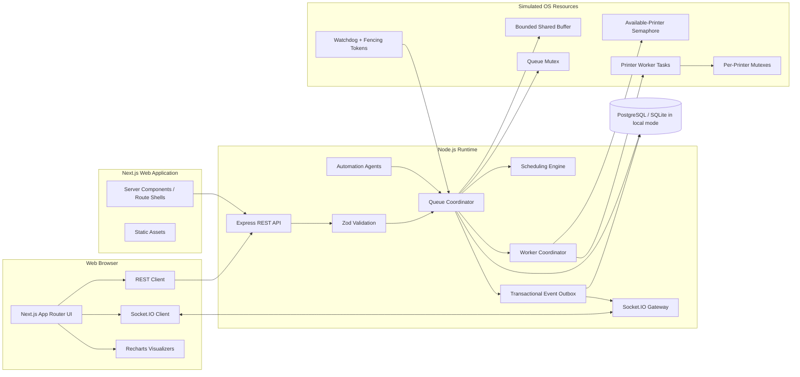
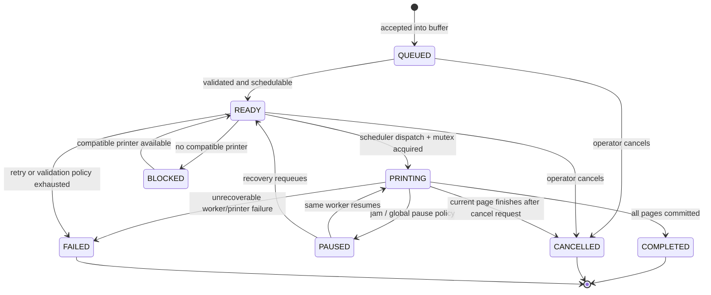

# Smart Printer Queue Management System — Architecture Specification

## 1. Architectural intent

The system is a browser-based Operating Systems simulation. It demonstrates scheduling, bounded-buffer coordination, worker concurrency, mutex ownership, semaphores, starvation prevention, and watchdog recovery while remaining deterministic and inspectable.

The browser never owns authoritative queue state. Next.js provides the application UI; an Express/Socket.IO service owns commands and real-time delivery; a dedicated in-process scheduling domain module owns the simulation state machine. Persistence stores configuration, audit history, completed runs, and recoverable snapshots. The default deployment is a single backend process so simulated locks retain clear semantics.

## 2. Component topology



### 2.1 Responsibility boundaries

| Component | Owns | Must not own |
|---|---|---|
| Next.js | presentation, navigation, form state, event reduction | scheduler decisions or authoritative locks |
| Express | authentication, validation, commands, query endpoints | UI state or direct array mutation |
| Queue Coordinator | atomic state transitions and invariants | visual formatting |
| Scheduling Engine | pure ordering/selection functions | I/O, timers, database writes |
| Worker Coordinator | printer task lifecycle and page advancement | global ranking policy |
| Agents | observation and versioned commands | direct state mutation |
| Persistence | snapshots, audit, event outbox, benchmark results | lock ownership arbitration |
| Socket.IO Gateway | authenticated delivery and rooms | business-state decisions |

## 3. Domain model

```ts
type JobStatus =
  | "QUEUED" | "READY" | "PRINTING" | "PAUSED"
  | "BLOCKED" | "COMPLETED" | "CANCELLED" | "FAILED";

interface PrintJob {
  id: string;
  ownerId: string;
  documentName: string;
  pages: number;
  pagesCompleted: number;
  basePriority: number;
  effectivePriority: number;
  colorMode: "MONO" | "COLOR";
  duplex: boolean;
  status: JobStatus;
  submittedAtMs: number;
  queuedAtMs: number;
  startedAtMs?: number;
  completedAtMs?: number;
  assignedPrinterId?: string;
  cancellationRequestedAtMs?: number;
  lastProgressAtMs?: number;
  retryCount: number;
  sequence: number;
  version: number;
}

interface Printer {
  id: string;
  name: string;
  status: "READY" | "RESERVED" | "PRINTING" | "JAMMED" | "ERROR" | "OFFLINE";
  pagesPerMinute: number;
  supportsColor: boolean;
  supportsDuplex: boolean;
  activeJobId?: string;
  fenceToken: number;
  version: number;
}
```

All duration math uses integer simulation milliseconds. IDs and submission sequence are immutable. Derived priority is not accepted from clients.

## 4. Process lifecycle



Transitions are checked centrally. Terminal states are immutable. `pagesCompleted` is monotonic and never exceeds `pages`.

## 5. Synchronization mechanics

### 5.1 Simulation versus runtime reality

Node.js executes JavaScript on one event loop, but asynchronous callbacks can still interleave across `await` boundaries. The system models OS synchronization explicitly and implements the same ownership rules with promise-based primitives. Critical sections contain no network I/O and no unbounded waits.

### 5.2 Queue mutex

The fair FIFO queue mutex protects:

- bounded-buffer membership;
- job lifecycle transitions affecting membership;
- rank/order replacement;
- printer reservation paired with job removal;
- state-version increments.

The mutex is non-reentrant. Acquisition has a timeout. The holder releases in `finally`. Code never calls an external adapter while holding it.

```ts
await queueMutex.runExclusive(async () => {
  assertStateVersion(command.expectedStateVersion);
  const job = scheduler.selectNext(readyJobs, config, clock.now());
  reserveAtomically(job, printer);
  commitDomainEvents();
});
```

### 5.3 Per-printer mutex and lease

Each printer has a binary mutex. A worker receives `{ leaseId, fenceToken, expiresAt }` on acquisition. Every progress commit includes both values. A watchdog increments the printer's fence token before a forced release, so messages from the former worker are rejected even if they arrive late.

Lock order is always queue mutex then printer mutex. A worker that needs to publish progress does not reacquire the queue lock while holding a blocking call; it prepares the update, enters the short critical section, commits, and exits.

### 5.4 Available-printer semaphore

The counting semaphore value equals the number of compatible ready capacity slots, bounded by total online printers. Dispatch consumes a permit only after a job is selected. Completion, cancellation after a page boundary, failure cleanup, or recovery returns exactly one permit. Invariant checks compare permits with derived ready capacity and pause dispatch if they diverge.

### 5.5 Bounded shared buffer

The ready/queued buffer has configurable capacity `C`, default 1,000. Producers are REST or burst-submission commands; consumers are printer workers coordinated by the scheduler.

- Single submission at capacity returns `QUEUE_CAPACITY_EXCEEDED`.
- Atomic burst submission succeeds only if `freeSlots >= burstSize`.
- Explicit partial burst mode accepts `min(freeSlots, burstSize)` in input order and reports the rest.
- Cancellation frees a slot immediately for non-running jobs.
- Completed history is stored outside the active buffer.

Conceptually this is the producer-consumer pattern using `emptySlots`, `readyJobs`, and `queueMutex`. The implementation derives counts from authoritative state to avoid semaphore drift while exposing the conceptual values in analytics.

### 5.6 Deadlock and race prevention

- One global lock order: `queue -> printer`.
- No lock acquisition inside event listeners.
- No database, Socket.IO, or HTTP call inside a critical section.
- Idempotency keys prevent duplicate producer inserts.
- Expected state versions prevent lost updates.
- Fencing tokens prevent stale workers from committing.
- Invariant checks run after every mutation in development/test and periodically in production.

## 6. Scheduling algorithms

Let job `j` have arrival time `a_j`, remaining service estimate `s_j`, base priority `p_j`, sequence `q_j`, and current simulation time `t`.

### 6.1 First-Come, First-Served (FCFS)

Non-preemptive ordering:

\[
j^*=\arg\min_j(a_j,q_j)
\]

Arrival time wins; sequence provides deterministic order for simultaneous arrivals. FCFS is simple and fair by arrival but may exhibit the convoy effect.

### 6.2 Shortest Job First (SJF)

Non-preemptive ordering by predicted remaining burst:

\[
s_j=\left\lceil\frac{pages_j-pagesCompleted_j}{compatiblePagesPerMs}\right\rceil
\]

\[
j^*=\arg\min_j(s_j,a_j,q_j)
\]

The estimate uses the assigned candidate printer where known, otherwise the median speed of compatible online printers. SJF lowers mean wait for known burst lengths but can starve long jobs; the UI reports that trade-off. The requested algorithm remains pure SJF rather than silently mixing aging into it.

### 6.3 Priority with Dynamic Aging

Priorities are integers `0..100`; larger values win. For aging interval `T`, factor `F`, and cap `P_cap`:

\[
wait_j(t)=\max(0,t-a_j)
\]

\[
P_{effective}(j,t)=\min(P_{cap},p_j+\lfloor\frac{wait_j(t)}{T}\rfloor F)
\]

Selection is:

\[
j^*=\arg\max_j(P_{effective}(j,t),-a_j,-q_j)
\]

Default values are `T=5,000 ms`, `F=2`, and `P_cap=100`. Effective priority is derived from timestamps, so missed timer ticks never lose aging. The policy is non-preemptive; a priority change affects only jobs not yet printing.

### 6.4 Timing metrics

For completion time `c_j`, first start `b_j`, and actual simulated service time `r_j`:

\[
turnaround_j=c_j-a_j
\]

\[
response_j=b_j-a_j
\]

\[
wait_j=turnaround_j-r_j
\]

Throughput is completed jobs divided by elapsed simulation minutes. Printer utilization is busy simulation time divided by online simulation time. Interrupted time due to jam is not busy time.

## 7. Dispatch and worker sequence

```mermaid
sequenceDiagram
  participant D as Automation Daemon
  participant Q as Queue Coordinator
  participant S as Scheduler
  participant M as Queue Mutex
  participant P as Printer Worker
  participant L as Printer Mutex
  participant O as Event Outbox

  D->>Q: DISPATCH_NEXT_JOB(printerId, stateVersion)
  Q->>M: acquire
  Q->>S: selectNext(snapshot, config, now)
  S-->>Q: selected job
  Q->>L: reserve/acquire lease
  Q->>Q: READY -> PRINTING; bind job/printer
  Q->>O: append job/printer events
  Q->>M: release
  Q-->>P: start(job, lease, fenceToken)
  loop each simulated page
    P->>Q: commitProgress(page, lease, fenceToken)
    Q->>O: append job.progressed
  end
  P->>Q: complete(job)
  Q->>Q: mark completed; release printer and permit
  Q->>O: append completion events
  Q->>L: release
```

## 8. Socket.IO real-time protocol

### 8.1 Envelope

Every server event uses one envelope:

```ts
interface SocketEnvelope<TType extends string, TData> {
  protocolVersion: 1;
  eventId: string;
  type: TType;
  occurredAt: string;
  correlationId: string;
  stateVersion: number;
  simulationTimeMs: number;
  data: TData;
}
```

Connections authenticate during the Socket.IO handshake. Clients join `simulation:{simulationId}` and optionally `user:{userId}`. The server orders state-changing events by `stateVersion`. Ephemeral `job.progressed` frames may share a committed version only when they do not change lifecycle state; each still has a unique event ID.

### 8.2 Client-to-server events

REST is preferred for commands. Socket client events manage subscriptions and latency-sensitive simulation controls.

| Event | Payload | Ack |
|---|---|---|
| `simulation.subscribe` | `{ simulationId, lastSeenStateVersion? }` | current version or `RESYNC_REQUIRED` |
| `simulation.unsubscribe` | `{ simulationId }` | success |
| `simulation.pause.request` | `{ expectedStateVersion, commandId }` | command result |
| `simulation.resume.request` | `{ expectedStateVersion, commandId, speedMultiplier? }` | command result |
| `simulation.speed.request` | `{ expectedStateVersion, commandId, speedMultiplier }` | command result |
| `telemetry.preference.set` | `{ progressHz: 1 | 2 | 4 | 10 }` | accepted rate |
| `client.ping` | `{ sentAt }` | `{ sentAt, serverAt }` |

### 8.3 Server-to-client events

| Event | Key data | Meaning |
|---|---|---|
| `system.snapshot` | complete jobs/printers/config/metrics | initial state or resync |
| `job.created` | job | accepted into active buffer |
| `job.updated` | job + changed fields | lifecycle/configuration change |
| `job.progressed` | jobId, pagesCompleted, totalPages | page boundary committed |
| `job.completed` | job + timing metrics | terminal completion |
| `job.cancelled` | jobId, stoppedAfterPage | cancellation committed |
| `job.failed` | jobId, error code | terminal failure |
| `queue.reordered` | ordered job IDs + reasons | scheduler order changed |
| `queue.capacity.updated` | used, capacity | active-buffer occupancy |
| `printer.created` | printer | new simulated device |
| `printer.updated` | printer + changed fields | status/capability change |
| `printer.jammed` | printerId, jobId?, recovery time? | injected or simulated jam |
| `printer.recovered` | printerId, resumedJobId? | ready again |
| `mutex.acquired` | resourceId, lease metadata | lock inspection event |
| `mutex.released` | resourceId, heldForMs | normal release |
| `mutex.force_released` | resourceId, fenced lease | watchdog recovery |
| `scheduler.config.updated` | algorithm/aging/revision | scheduling configuration changed |
| `metrics.updated` | metrics snapshot | rolling metrics update |
| `agent.status.updated` | agent, health, circuit | automation health change |
| `alert.raised` | severity, code, message | actionable user warning |
| `alert.cleared` | alertId | warning resolved |
| `benchmark.completed` | benchmark ID, summary | isolated evaluation finished |
| `audit.entry.created` | safe audit summary | traceable command outcome |
| `system.resync.required` | expected, actual version | client must fetch snapshot |

### 8.4 Delivery, recovery, and backpressure

Socket.IO delivery is at least once. Clients deduplicate by `eventId` and ignore state versions not newer than the applied version. On a version gap, the reducer stops applying mutations and requests `/api/v1/state`; no attempt is made to infer missing changes.

Progress telemetry is coalescible: when a client cannot keep up, only the latest uncommitted progress frame per job is retained. Lifecycle, lock, alert, and audit events are never dropped. Reconnection uses exponential backoff with jitter, capped at 10 seconds.

## 9. Persistence and consistency

Tables/collections include `simulations`, `jobs`, `printers`, `scheduler_configs`, `domain_events`, `audit_entries`, `benchmark_runs`, and `idempotency_keys`. The active in-memory model is restored from the latest snapshot plus subsequent events. The transactional outbox ensures a committed change is eventually emitted even if Socket.IO delivery temporarily fails.

For the local classroom deployment, SQLite in WAL mode is sufficient. Production or multi-user deployment uses PostgreSQL. The active simulation remains single-writer; horizontal Socket.IO gateways consume published outbox events through the chosen adapter.

## 10. Failure model and recovery

- **Browser disconnect:** server continues; client resynchronizes from snapshot.
- **Socket gateway failure:** REST remains available; outbox retains events.
- **Backend restart:** active simulation pauses, restores snapshot/event tail, invalidates worker leases, and requeues incomplete jobs with retained page counts.
- **Worker stall:** watchdog verifies missed progress, fences lease, releases mutex, and requeues or fails according to retry count.
- **Database unavailable:** reject new mutations with `503`; do not apply in-memory changes that cannot be persisted.
- **Invariant failure:** pause dispatch, preserve state, emit critical alert, and require operator reset or restore.

## 11. Security boundaries

All REST and Socket payloads are schema-validated. Authentication identifies users; role checks distinguish viewer, operator, and administrator. Fault injection and scheduler configuration require operator privileges. Rate limits protect submissions, bursts, benchmarks, and mutation commands separately. Document contents are never uploaded—the simulator stores only metadata. Logs redact tokens and do not contain document names when privacy mode is enabled.

## 12. Scaling constraints

One active simulation has one authoritative coordinator. This deliberately favors correct, visible synchronization over distributed locking. Scale across users by partitioning simulations across coordinator processes, not by allowing multiple writers for one simulation. A distributed coordinator or external lock service is warranted only if a measured requirement demands multi-writer simulation state.
