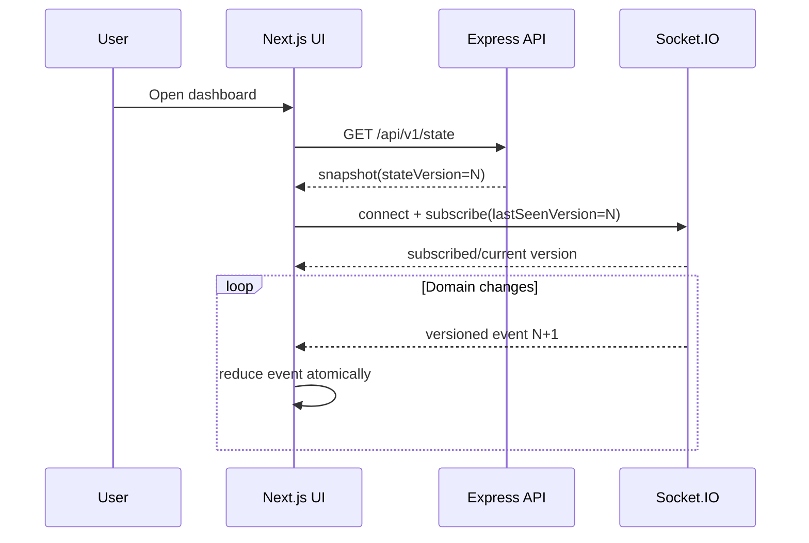

# Smart Printer Queue Management System — Product and Visual Design

## 1. Experience goals

The interface makes normally invisible operating-system behavior observable: jobs enter a bounded buffer, a scheduler orders them, printer workers acquire locks, faults interrupt progress, and the watchdog restores liveness. The product should feel like a live operations console without becoming visually noisy.

Primary design principles:

1. **State before decoration:** every color, animation, and badge communicates a lifecycle state or action.
2. **Deterministic inspection:** selecting a job reveals why it holds its current rank.
3. **Safe experimentation:** destructive simulation controls are explicit, reversible where possible, and separated from normal submission.
4. **Progressive depth:** a first-time user can submit a job immediately; OS students can open lock, scheduling, and timing details.
5. **Accessible motion:** the simulation remains understandable with reduced motion and without color perception.

## 2. Design system

### 2.1 Typography and spacing

- UI font: `Inter`, falling back to `ui-sans-serif, system-ui, sans-serif`.
- Numeric/telemetry font: `JetBrains Mono`, falling back to `ui-monospace, monospace`.
- Base type: 14 px on dense desktop surfaces, 16 px on form and mobile surfaces.
- Scale: 12, 14, 16, 20, 24, 32 px.
- Spacing uses a 4 px base: `1=4`, `2=8`, `3=12`, `4=16`, `6=24`, `8=32`.
- Corners: 8 px controls, 12 px cards, 16 px primary panels.
- Shadows are reserved for overlays; bordered surfaces define dashboard hierarchy.

### 2.2 Color tokens

Tokens are CSS variables consumed by Tailwind and Shadcn components. Values show the light theme; dark mode derives accessible equivalents with unchanged semantic names.

```css
:root {
  --background: 210 40% 98%;
  --foreground: 222 47% 11%;
  --card: 0 0% 100%;
  --card-foreground: 222 47% 11%;
  --muted: 210 40% 96%;
  --muted-foreground: 215 16% 47%;
  --border: 214 32% 91%;
  --primary: 221 83% 53%;
  --primary-foreground: 210 40% 98%;
  --ready: 158 64% 40%;
  --ready-foreground: 0 0% 100%;
  --printing: 217 91% 60%;
  --printing-foreground: 0 0% 100%;
  --warning: 38 92% 50%;
  --warning-foreground: 26 83% 14%;
  --error: 0 72% 51%;
  --error-foreground: 0 0% 100%;
  --paused: 262 83% 58%;
  --paused-foreground: 0 0% 100%;
  --completed: 172 66% 36%;
  --focus: 221 83% 53%;
}
```

All body text and status label combinations target WCAG 2.2 AA contrast. Color is paired with icon, text, and where useful a pattern. Focus rings use a 2 px visible outline with a 2 px offset.

### 2.3 Status language

| State | Token | Icon | Badge copy | Secondary cue |
|---|---|---|---|---|
| Ready | `ready` | check circle | Ready | solid green dot |
| Queued | `muted` | list ordered | Queued | rank number |
| Printing | `printing` | printer | Printing | animated progress line |
| Paused | `paused` | pause | Paused | two vertical bars |
| Error/Jammed | `error` | triangle alert | Error / Paper jam | striped red edge |
| Starvation warning | `warning` | clock alert | Starvation risk | amber pulse, once |
| Completed | `completed` | circle check | Completed | completion timestamp |
| Offline | `muted` | unplug | Offline | dashed outline |

Badge text is never replaced by color. Live updates announce important status changes in an `aria-live="polite"` region; critical watchdog alerts use `role="alert"`.

### 2.4 Core component behavior

- `Button`: primary for the page's dominant action; destructive variant for cancellation and fault injection; loading state preserves width.
- `Card`: title, optional action, content, footer. Telemetry cards use tabular numerals.
- `DataTable`: sticky header, keyboard-focusable rows, accessible sort labels, pagination only for history—not the live queue.
- `Sheet`: mobile detail view and job inspector; desktop uses a right-side resizable panel.
- `Dialog`: confirmation for fault injection, force recovery, and clearing a workload.
- `Tooltip`: supplemental only; never the sole source of essential information.
- `Toast`: acknowledges commands. Ongoing system states remain visible in cards or banners.

## 3. Global application shell

Desktop layout uses a 240 px collapsible left navigation, a 56 px header, and a fluid content region. Tablet collapses navigation to icons; mobile uses a bottom navigation for Dashboard, Submit, Analytics, and Benchmark.

Header contents:

- application name and environment badge;
- Socket connection indicator (`Live`, `Reconnecting`, `Offline`);
- simulation clock and speed control;
- pause/resume control;
- theme and accessibility menu;
- operator menu.

Global banners appear below the header for offline operation, open watchdog circuits, or simulation-wide pause. Reconnection never discards the visible snapshot; it marks it stale until resynchronization.

## 4. Page 1 — Main Live Control Dashboard

Route: `/dashboard`

### Purpose

Operate and observe the simulation in one view. The initial viewport answers: What is printing? What is waiting? Are printers healthy? Is the scheduler making progress?

### Desktop layout

```text
┌ KPI: queued ┬ printing ┬ throughput ┬ avg wait ┬ warnings ┐
├───────────────────────────────┬─────────────────────────────┤
│ Live queue (ranked rows)      │ Printer fleet              │
│ rank/job/pages/priority/wait  │ one card per printer        │
│ scheduler explanation         │ lock owner + progress       │
├───────────────────────────────┼─────────────────────────────┤
│ Recent event stream           │ Automation & watchdog       │
└───────────────────────────────┴─────────────────────────────┘
```

### Sections and interaction

1. **KPI strip:** queued count, active count, throughput, average wait, utilization, and starvation warnings. Each metric shows its sampling window.
2. **Live queue:** virtualized only above 200 jobs. Rows show stable rank, job name, owner alias, pages remaining, base/effective priority, wait duration, and state. Clicking opens Job Inspector.
3. **Scheduler explanation:** for the selected row, show the active comparator and a plain-language reason such as “Rank 2: effective priority 74; tie broken by earlier submission.”
4. **Printer fleet:** cards show printer state, active job, page progress, speed, mutex owner/lease age, and compatible modes. Operator actions include jam, recover, offline, and inspect lock.
5. **Event stream:** newest-first domain events with type filters and correlation-ID copy action. Events are retained in the view without flashing.
6. **Automation panel:** agent health, last action, circuit state, watchdog threshold, and alert history.

### Empty, error, and stale states

- Empty queue: illustration-free callout, “No jobs waiting,” plus `Submit a job` and `Generate workload` actions.
- No printers: block submission only when the queue is also at capacity; explain that jobs can wait until a printer is added.
- Socket disconnected: freeze animation, keep last snapshot, show timestamp and retry state.
- Snapshot gap: disable mutations, fetch `/api/v1/state`, apply it atomically, then resume events.

## 5. Page 2 — Job Submission and Burst Generator

Route: `/jobs/new`

### Single job form

Fields:

- document name, 1–120 characters;
- pages, integer 1–10,000;
- base priority, integer 0–100 with labels Low, Normal, High, Critical;
- color mode: monochrome or color;
- duplex toggle;
- optional delayed arrival in simulation milliseconds.

The form validates on blur and submit using the same schema as the API. A capacity meter shows buffer use. Submission returns immediately with the queued job and highlights it on the dashboard.

### Burst generator

The generator creates reproducible workloads, not actual document files.

Controls:

- number of jobs: 1–1,000;
- seed: unsigned 32-bit integer;
- arrival pattern: simultaneous, uniform interval, or Poisson;
- page distribution: fixed, uniform range, or bounded normal;
- priority distribution: fixed, uniform, or weighted classes;
- color and duplex ratios;
- preview table and aggregate totals.

`Generate preview` is pure. `Enqueue burst` shows the exact accepted/rejected count. If the bounded buffer cannot fit the entire burst, the default is atomic rejection; an explicit “enqueue available capacity only” mode permits partial acceptance and lists rejected items.

### Safety and accessibility

Fault controls are not on the submission form. The submit button cannot double-submit; it uses an idempotency key. Sliders have numeric inputs and keyboard controls. Generated values remain editable in preview.

## 6. Page 3 — Real-Time OS Analytics and Gantt Visualizer

Route: `/analytics`

### Purpose

Connect visible execution to OS concepts: process states, context assignment, wait/turnaround time, critical sections, and utilization.

### Sections

1. **Time range and controls:** live/paused mode, rolling window, zoom, algorithm filter, printer filter, and “follow now.”
2. **Gantt chart:** one lane per printer. Segments represent job execution; gaps show idle, jammed, or offline intervals with distinct patterns. Segment tooltips contain start/end, pages processed, wait, and interruption reason.
3. **Queue depth chart:** step chart of ready/blocked/running counts over simulation time.
4. **Wait and turnaround distributions:** Recharts histograms or box summaries, with sample size and percentile labels.
5. **Mutex timeline:** lock acquire, lease renewal, release, forced release, and waiter count. A vertical cursor synchronizes all charts.
6. **Process state diagram:** selected job's transitions from `QUEUED` through terminal state.
7. **Formulas drawer:** displays metric definitions and the current aging calculation using selected job values.

### Gantt interactions

- Pointer wheel or buttons zoom the time scale; drag pans when not following live time.
- Clicking a segment selects the corresponding job across all panels.
- Keyboard users navigate lanes and segments with arrow keys and open details with Enter.
- New segments extend smoothly using transform/width transitions; historical segments never reorder.
- With reduced motion, charts update discretely and the live cursor does not glide.

## 7. Page 4 — Algorithm Benchmark Matrix

Route: `/benchmarks`

### Purpose

Compare FCFS, SJF, and Priority with Dynamic Aging against the exact same immutable workload and printer model.

### Workflow

1. Select a saved workload, generate one, or clone the current queue snapshot.
2. Configure printer count/speed and aging parameters.
3. Select algorithms.
4. Run the deterministic benchmark.
5. Compare metrics and inspect per-algorithm Gantt results.

### Matrix

Columns are algorithms. Rows are average wait, median wait, p95 wait, average turnaround, makespan, throughput, utilization, Jain fairness, and starvation count. The best numeric result is marked with text and an icon, not color alone. Metrics whose direction differs explicitly show “lower is better” or “higher is better.”

Below the matrix:

- small-multiple Gantt charts share a time scale;
- rank-change table shows jobs most affected by algorithm choice;
- trade-off summary states facts only, e.g. “SJF lowered average wait by 18% but increased maximum wait by 42%.”
- export actions produce JSON and CSV; no screenshot export is required.

Benchmarks run outside live state. The UI labels the workload hash, random seed, configuration revision, and engine version so results are reproducible.

## 8. Next.js component tree

```text
app/
├── layout.tsx
│   ├── ThemeProvider
│   ├── SocketProvider
│   ├── QueryProvider
│   ├── SimulationProvider
│   └── AppShell
│       ├── SideNavigation
│       ├── ApplicationHeader
│       ├── SystemBanner
│       └── RouteContent
├── dashboard/page.tsx
│   └── DashboardView
│       ├── MetricsStrip
│       ├── LiveQueueCard
│       │   ├── SchedulerToolbar
│       │   ├── QueueTable
│       │   └── JobInspectorSheet
│       ├── PrinterFleet
│       │   └── PrinterCard[]
│       │       ├── JobProgress
│       │       ├── MutexBadge
│       │       └── PrinterActionsMenu
│       ├── EventStream
│       └── AgentHealthPanel
├── jobs/new/page.tsx
│   └── SubmissionView
│       ├── JobForm
│       ├── QueueCapacityMeter
│       └── BurstGenerator
│           ├── DistributionControls
│           └── BurstPreviewTable
├── analytics/page.tsx
│   └── AnalyticsView
│       ├── TimelineToolbar
│       ├── PrinterGanttChart
│       ├── QueueDepthChart
│       ├── LatencyDistribution
│       ├── MutexTimeline
│       └── ProcessStatePanel
└── benchmarks/page.tsx
    └── BenchmarkView
        ├── WorkloadConfigurator
        ├── AlgorithmSelector
        ├── BenchmarkMatrix
        ├── GanttSmallMultiples
        └── BenchmarkExportMenu

components/ui/                 # Shadcn primitives only
components/domain/             # composed job/printer/scheduler components
lib/socket/                    # connection and event reducer
lib/api/                       # typed REST client
lib/charts/                    # Recharts adapters and scales
```

Server Components render page shells and initial snapshots. Components requiring live Socket.IO state, forms, dialogs, or Recharts use `"use client"`. Domain data is passed as serializable values; Socket clients are never created during server rendering.

## 9. State and interaction flows

### 9.1 Initial load and live synchronization



Events with the next version animate only the affected row/card. Duplicate or older versions are ignored. A gap triggers snapshot resync.

### 9.2 Submit job

The user validates a form, submits through REST with an idempotency key, receives `202 Accepted`, and sees a pending row. `job.created` replaces the optimistic row by matching correlation ID. A rejection removes it and focuses the relevant error summary.

### 9.3 Paper-jam interception

The user confirms fault injection; the printer card immediately shows a command-pending overlay. The server emits `printer.jammed`, the active segment changes to a striped error interval, and the affected job becomes paused. Auto-recovery counts down using simulation time. Watchdog takeover uses a critical banner only if normal recovery fails.

### 9.4 Algorithm switch

Changing the scheduler opens a comparison summary, then sends a version-checked command. Running jobs continue. Queue rows move with a short FLIP transition; rank changes display `old → new` briefly. Screen readers receive one summary announcement instead of every row movement.

## 10. Responsive, accessibility, and performance requirements

- Supported viewport: 360 px wide through large desktop.
- At widths below 768 px, tables become prioritized cards; no essential column is reachable only by horizontal scroll.
- All controls are usable by keyboard and meet a 44×44 px touch target where practical.
- Charts include a text/table alternative and do not rely on hover.
- `prefers-reduced-motion` disables pulsing, smooth cursor motion, and row movement animations.
- Live updates are batched to animation frames; KPI updates are throttled to four per second without dropping state transitions.
- Queue rendering remains responsive at 1,000 visible jobs; history is server-paginated.
- Dates are displayed in local time with exact ISO time available in details.

## 11. Content rules

Use “job,” “printer,” “queue,” “priority,” and “wait time” consistently. Explain “mutex” on first appearance as “exclusive printer lock.” Errors state what happened, retained state, and recovery action. Avoid claiming physical printing: all labels identify execution as simulated.
