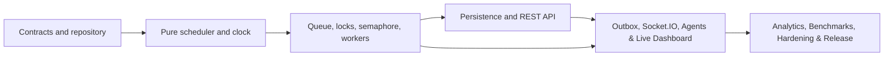

# Smart Printer Queue Management System — Implementation Roadmap

## 1. Roadmap objective

This roadmap turns the approved product, architecture, design, API, agent, and test specifications into a buildable sequence. It defines what is built, when it is built, why that order is required, and the evidence needed before dependent work begins.

The accelerated delivery window is **6 weeks**, from **Monday, September 21, 2026 through Friday, October 30, 2026**:
- **Weeks 1 to 4** establish the verified foundation: shared contracts, pure scheduling engine, synchronization primitives, bounded queue, worker coordinator, persistence, and the REST command/query API (completed).
- **Weeks 5 and 6** compress the remaining scope (formerly Weeks 5–12) into **two intensive, parallelized delivery phases** without reducing any features, test cases, invariants, or security/deployment gates.

The plan assumes:

- two full-time software engineers working concurrently across frontend and backend;
- one engineer focused on real-time streaming, domain agents, and hardening; one engineer focused on web UI, live reducers, and analytics/Gantt charts; with shared ownership of end-to-end integration;
- a part-time product designer or design-capable frontend engineer;
- part-time QA/DevOps support, or those duties shared by the engineers;
- the project builds on top of the completed Week 1–3 foundation;
- no physical printer integration, document uploads, or additional scheduling algorithms are added during the core release.

For one developer, preserve the same phase order and plan approximately 12–14 weeks. Adding people enables parallel UI, test, and deployment work across Weeks 5 and 6, but does not compress the scheduler/synchronization critical path without increasing regression risk.

## 2. Non-negotiable build order



The sequence is deliberate:

1. Contracts come first because every layer shares job, printer, command, error, and event shapes.
2. Scheduling functions come before Express or React so correctness is tested without transport concerns.
3. Locks, bounded-buffer behavior, and workers come before persistence because they define authoritative state transitions.
4. REST comes before Socket.IO because commands and snapshot reads must work without live delivery.
5. The outbox comes before the live UI so events represent committed state, not optimistic server memory.
6. The dashboard comes before analytics; analytics requires trustworthy event history.
7. Benchmarks reuse the proven scheduler but remain isolated from live state.
8. Fault injection and watchdog recovery are built only after normal completion and cancellation are reliable.
9. Performance, security, and deployment hardening happen throughout, with a dedicated release gate after feature completion.

## 3. Milestones

| Milestone | Target date | Outcome | Release decision |
|---|---:|---|---|
| M0 — Contracts frozen for implementation | Sep 25 | repository, schemas, CI, reference fixtures | engineering may build against v1 contracts |
| M1 — Domain engine proven | Oct 9 | schedulers, locks, workers, cancellation pass deterministically | API integration may begin |
| M2 — Persistence and REST API | Oct 16 | persistent REST commands, snapshot, durable PostgreSQL/SQLite | ready for real-time and client integration |
| M3/M4 — Real-time stream, Agents & Live Dashboard | Oct 23 | outbox, Socket.IO, agents, watchdog, full control dashboard | instructor usability testing begins |
| M5 — Feature complete (Analytics & Benchmarks) | Oct 27 | synchronized Gantt, metrics, benchmark runner, exports | scope freezes; final hardening & release gates |
| M6 — Release candidate & Hardening | Oct 29 | security, accessibility, 64-worker stress, restore drills | go/no-go review |
| M7 — v1 demonstration release | Oct 30 | deployed, rehearsed, observable, recoverable release | project accepted |

## 4. Workstreams and ownership

| Workstream | Primary owner | Responsibilities |
|---|---|---|
| Domain engine | Backend/domain engineer | scheduler, clock, queue coordinator, locks, workers, invariants |
| API and persistence | Backend/domain engineer | Express, Prisma, PostgreSQL/SQLite, commands, queries, outbox |
| Real-time and agents | Backend owner with frontend reviewer | Socket.IO, replay/resync, automation, watchdog, metrics |
| Web experience | Frontend engineer | App Router, Shadcn UI, forms, live reducer, dashboard, charts |
| Contracts | Shared | Zod schemas, inferred types, fixtures, API/event compatibility |
| Quality | Shared, QA lead if available | automated tests, stress, accessibility, E2E, trace artifacts |
| Delivery | Shared, DevOps lead if available | Docker, migrations, CI/CD, health, logging, rollback |

No feature is considered “backend complete” until its contract and automated tests exist. No page is considered “frontend complete” until loading, empty, stale, disconnected, forbidden, validation, and success states are handled.

## 5. Week-by-week delivery plan

## Week 1 — Foundation and executable contracts

**Dates:** September 21–25, 2026  
**Goal:** create a reproducible monorepo and make shared schemas the first executable code.

### Build in this order

1. Create the pnpm workspace, root scripts, strict TypeScript configuration, ESLint, Prettier, and Vitest.
2. Scaffold `apps/web`, `apps/api`, `packages/contracts`, `packages/config`, and `packages/test-fixtures` exactly as described in `TECH_STACK.md`.
3. Add environment validation and checked-in `.env.example` files without secrets.
4. Implement Zod schemas and inferred types for jobs, printers, scheduler configuration, simulation state, API envelopes, errors, commands, and Socket envelopes.
5. Create deterministic reference workloads for FCFS, SJF, Priority Aging, cancellation, printer compatibility, and simultaneous arrivals.
6. Add CI for install, formatting, lint, type checking, unit tests, and production builds.
7. Scaffold Express health endpoints and a minimal Next.js application shell solely to prove builds and service connectivity.

### Deliverables

- Workspace installs from a clean checkout with `pnpm install --frozen-lockfile`.
- Shared contracts compile without importing React, Express, Prisma, or Socket.IO.
- `/health/live` and `/health/ready` have typed responses.
- Web app displays environment and API readiness without domain behavior.
- CI blocks contract/type/test failures.

### Exit gate M0

- All external payloads documented in `API_AND_EVENTS.md` have a v1 schema or an explicitly scheduled schema task.
- Strict type checking, lint, unit test command, and production builds pass.
- Reference fixtures are reviewed for correct expected order and metrics.
- No UI behavior relies on handwritten duplicate domain types.

## Week 2 — Pure scheduling engine and simulation clock

**Dates:** September 28–October 2, 2026  
**Goal:** prove deterministic scheduling and time calculations without HTTP, database, timers, or UI.

### Build in this order

1. Implement immutable domain entities and legal lifecycle-transition rules.
2. Implement the monotonic simulation clock with pause, resume, speed multiplier, and manual advancement for tests.
3. Implement stable FCFS using arrival time and sequence.
4. Implement non-preemptive SJF using predicted remaining service time and compatible printer speed.
5. Implement non-preemptive Priority with Dynamic Aging using the exact documented formula and cap.
6. Return structured scheduler explanations with every selection.
7. Implement pure wait, response, service, turnaround, throughput, fairness, and utilization calculations.
8. Run reference and edge-case tests from `SCH-001` through `SCH-022`.

### Deliverables

- Pure scheduler module with no framework or persistence dependencies.
- Fake/manual clock used by every time-sensitive test.
- Golden workload results for all algorithms.
- Performance measurement for selecting from 10,000 jobs.

### Exit gate

- All scheduler matrix tests pass deterministically across repeated runs.
- Base priority never mutates during aging.
- Pausing the clock freezes derived waits and watchdog durations.
- Running jobs remain unaffected by a scheduler switch.

## Week 3 — Synchronization, bounded queue, and printer workers

**Dates:** October 5–9, 2026  
**Goal:** establish the authoritative in-memory operating-system simulation.

### Build in this order

1. Implement `FairMutex` with FIFO waiters, bounded acquisition, owner token, and `runExclusive`.
2. Implement `BinaryLeaseMutex` with lease renewal, expiry, and fencing token.
3. Implement `CountingSemaphore` with bounded permits and inspection state.
4. Implement `BoundedBuffer` with atomic single, atomic burst, and explicit partial burst modes.
5. Implement Queue Coordinator commands and state-version checks.
6. Implement printer worker loops that commit progress only at page boundaries.
7. Implement normal dispatch, completion, queued cancellation, active cancellation after current page, and printer compatibility blocking.
8. Add invariant assertions and controlled-interleaving tests `SYN-001` through `SYN-018`.
9. Add an in-process demonstration harness: submit jobs, run two printers, print lifecycle events, cancel one job, and finish cleanly.

### Deliverables

- Concurrent multi-printer domain simulation without network or database.
- Inspectable queue/printer mutex and semaphore state.
- Central lifecycle transition and invariant enforcement.
- Runnable deterministic domain demonstration.

### Exit gate M1

- Zero duplicate assignments or overlapping jobs per printer under stress.
- Buffer never exceeds capacity.
- Cancellation/completion races produce exactly one terminal state.
- Every acquisition releases on failure.
- Lock-order instrumentation finds no `printer -> queue` inversion.
- The demonstration completes with correct metrics and no leaked locks/permits.

## Week 4 — Persistence and REST command/query API

**Dates:** October 12–16, 2026  
**Goal:** make domain behavior durable and accessible through validated HTTP.

### Build in this order

1. Define Prisma models and initial migration for simulations, jobs, printers, scheduler configuration, domain events, audit entries, idempotency keys, snapshots, and benchmarks.
2. Implement repository adapters and database transaction boundary.
3. Persist state changes, audit records, and outbox entries as one logical transaction.
4. Restore the latest snapshot plus event tail on startup; invalidate previous worker leases.
5. Add Express middleware in the documented order: IDs, security headers, size limits, authentication stub/adapter, rate limits, validation, authorization, error mapping, logging.
6. Implement state, job, printer, scheduler, metrics, and health routes.
7. Implement version conflicts, idempotency, pagination, capacity errors, and error envelopes.
8. Add Supertest coverage for success, validation, authorization, conflict, idempotency, and persistence failure.

### Deliverables

- REST API supports the full normal job lifecycle.
- SQLite local mode and PostgreSQL development mode use the same migrations.
- Restart recovery resumes from the last committed page boundary.
- OpenAPI output is generated from or checked against executable schemas if enabled.

### Exit gate

- A database failure cannot produce a successful mutation or advance in-memory state.
- Repeating an idempotent command returns the original result.
- API tests cover every currently implemented error branch.
- A process restart preserves terminal history and safely recovers nonterminal jobs.

## Week 5 — Real-Time Outbox, Socket.IO, Autonomous Agents, Watchdog Recovery, and Live Operations Dashboard (Done)

**Dates:** October 19–23, 2026  
**Goal:** deliver end-to-end real-time simulation streaming, automated background agents, fault recovery, and the complete live operations dashboard with job submission and burst generation.

This week executes three coordinated, parallel streams across backend, frontend, and integration:

### Stream A: Backend, Real-Time Streaming, and Autonomous Agents

1. **Transactional Event Outbox & Socket.IO Gateway:**
   - Implement outbox dispatcher with retry, deduplication, and delivered-at tracking.
   - Add authenticated Socket.IO namespace, simulation rooms, and authorization handshake.
   - Emit the canonical event envelope with `stateVersion`, `eventIndex`, `eventId`, correlation ID, and simulation time.
   - Implement client subscription with last-seen tuple, bounded replay, and `RESYNC_REQUIRED` fallback.
   - Implement progress coalescing without dropping lifecycle, lock, alert, or terminal events.
   - Add integration tests `SOC-001` through `SOC-012`.
2. **Automation Daemon & Clock Coordination:**
   - Implement Automation Daemon tick (250 ms default), bounded per-printer command issuance, pause handling, and circuit breaker.
   - Request dispatch immediately on ready capacity slots without waiting for tick boundaries.
3. **Load Balancer Agent:**
   - Implement deterministic compatible-printer scoring ($score = availableAt + service + warmup + penalty$) and reservations (`ASSIGN_PRINTER`).
4. **Fault Injection & Recovery:**
   - Implement paper-jam and worker-stall injection behind the environment/role gate.
   - Implement printer recovery with retained committed pages.
5. **Watchdog Intercept Agent & Fencing Tokens:**
   - Implement worker heartbeats, missed-progress detection (`stuckThresholdMs = 15,000 ms`), fencing tokens, forced mutex release, retry count, and terminal retry exhaustion (`WATCHDOG_RETRY_EXHAUSTED`).
   - Execute exact recovery sequence: `FENCE_WORKER` -> increment fence token -> `STOP_WORK` -> `FORCE_RELEASE_MUTEX` -> `RECOVER_INTERRUPTED_JOB`.
6. **Starvation Guard Agent:**
   - Implement periodic queue audit and starvation warning/clear behavior (`starvationWarningMs = 30,000 ms`).
7. **Metrics Evaluator Agent:**
   - Implement rolling Metrics Evaluator outside the scheduling critical path (p95 wait times, throughput, printer utilization).
8. **Agent Observability & Integration:**
   - Expose agent status, alerts, fault/recovery routes, and audit events.
   - Run integration tests `AGT-001` through `AGT-015` and accelerated recovery scenarios.

### Stream B: Web Shell, Submission, Burst Generator, and Live Control Dashboard

1. **Application Shell & Identity Integration:**
   - Implement full application shell, navigation, header, theme tokens, connection indicator, simulation clock, and global status banners.
   - Integrate identity/role-aware controls (Viewer vs. Operator vs. Admin); unauthorized actions are absent or disabled with explanation.
2. **Real-Time Client Infrastructure:**
   - Build browser Socket provider and idempotent live-state reducer.
   - Seed the reducer from `GET /state`; stop reduction and fetch a fresh snapshot on a version gap.
3. **Job Submission & Burst Generation Form:**
   - Implement single-job form with shared schema, accessible validation summary, and idempotency key.
   - Implement deterministic burst controls and local preview using the contract generation model, checking cumulative arrival bounds.
   - Implement queue capacity meter and atomic/partial mode explanation.
   - Handle success, partial acceptance, capacity, rate-limit, disconnected, and stale-state behavior.
4. **Main Live Control Dashboard:**
   - Implement KPI strip with sampling-window labels.
   - Implement live queue table with rank, status, remaining pages, wait, priorities, and scheduler explanation.
   - Implement printer fleet cards with progress bar, capabilities, active job, mutex summary, and operator actions.
   - Implement Job Inspector and lock inspection panels.
   - Implement event stream with type filters and correlation ID support.
   - Implement agent health, circuit, watchdog threshold, and alerts panel.
   - Implement jam/recover/offline confirmations and command-pending states.
   - Optimize event batching and queue rendering responsiveness at 1,000 jobs.
   - Handle offline, stale, resync, empty, no-printer, full-queue, and error states gracefully.

### Stream C: Integration, Performance, and Automated E2E

1. Verify real-time convergence: UI reflects committed lifecycle events within 500 ms p95 on local network.
2. Run Playwright journeys from single submission and burst through dispatch, progress, completion, and cancellation.
3. Run paper-jam injection, watchdog recovery, and printer recovery browser journeys.

### Deliverables

- REST commands produce durable events visible in an authenticated browser client with zero page refreshes.
- Normal automation advances jobs without manual dispatch; Load Balancer distributes work.
- Jam and recovery preserve invariants; watchdog rejects stale worker updates after fencing.
- User can authenticate, submit single jobs, preview/generate bursts, and observe live execution.
- Operator can pause/resume, adjust speed, inject paper jams, trigger recovery, and inspect agent circuits.
- Viewer has read-only behavior with no privileged command paths.

### Exit gates M3 & M4

- **M3 (Recovery-Complete Backend):** Two missed progress windows precede interception; forced release is impossible before successful fencing; three stalls result in terminal failure (`WATCHDOG_RETRY_EXHAUSTED`); metrics failures do not stop dispatch; end-to-end backend scenario completes jobs after injected jam.
- **M4 (Usable Product Beta):** Live state converges within 500 ms p95; version gaps cause visible stale state and atomic resync before commands re-enable; queue remains responsive at 1,000 jobs; new user can submit a job within 2 minutes; instructor usability review can complete the core demonstration without developer assistance.

---

## Week 6 — Real-Time Analytics & Gantt, Benchmark Engine & Matrix, System Hardening, and Production Demonstration Release

**Dates:** October 26–30, 2026
**Goal:** complete the visual educational toolset (Gantt and benchmarks), execute comprehensive reliability/security/accessibility hardening, and deploy the verified production demonstration release.

This week executes three parallel streams:

### Stream A: Real-Time Analytics, Gantt Visualizations, and Benchmark Comparison Engine

1. **Real-Time Analytics & Gantt Visualization:**
   - Implement timeline query/view models for execution, idle, jam, offline, queue depth, and mutex intervals.
   - Implement shared simulation-time axis and visible-range filtering.
   - Build printer-lane Gantt chart with synchronized selection and accessible table alternative.
   - Build queue-depth chart, wait/turnaround summaries, mutex timeline, and process-state panel.
   - Add follow-live, pause inspection, zoom, pan, and filter controls.
   - Add reduced-motion behavior and keyboard chart navigation.
   - Validate computed metrics against reference workloads and API values.
2. **Algorithm Benchmark Engine & Comparison Matrix:**
   - Implement normalized immutable workload snapshots and SHA-based workload hash.
   - Implement isolated benchmark runner reusing proven pure schedulers (FCFS, SJF, Priority Aging) and simulation clock.
   - Enforce workload/printer/config limits (up to 10,000 jobs) and cancellation/timeouts.
   - Persist benchmark metadata and results without changing active simulation state or version.
   - Implement benchmark REST endpoints and `benchmark.completed` event.
   - Build workload selector/configurator and algorithm selection UI.
   - Build metric matrix (average wait, turnaround, makespan, throughput, utilization, fairness, starvation count).
   - Build shared-scale Gantt small multiples, rank-change table, and factual trade-off summary.
   - Implement exact numeric JSON and CSV export.
   - Test identical seeds/configurations, workload isolation, and 10,000-job upper bound.

### Stream B: Security, Accessibility, Reliability, and Performance Hardening

1. **Full-Suite Test Execution:**
   - Run entire unit, domain integration, HTTP, Socket, component, and E2E matrices.
2. **Stress & Concurrency Hardening:**
   - Execute concurrent burst, 64-worker stress, reconnect, outbox restart, and 30-minute accelerated soak tests.
3. **Security & Authorization Audit:**
   - Verify authentication, role RBAC (Viewer, Operator, Admin), CSRF tokens, CORS allowlist, security headers, payload limits, and rate limits.
   - Run dependency/license/vulnerability scanning and prune unused packages.
4. **Accessibility Verification (WCAG 2.2 AA):**
   - Run automated and manual keyboard, screen-reader, contrast, and reduced-motion checks across all pages.
5. **Profiling & Optimization:**
   - Profile API scheduling, Socket delivery, queue rendering, and chart windowing against performance targets.
6. **Data Recovery & Resilience Drills:**
   - Test database backup/restore, snapshot recovery, migration from previous schema, and rollback compatibility.
7. **Defect Triage & Code Freeze:**
   - Fix all release-blocking defects; freeze contract changes except critical fixes with coordinated clients.

### Stream C: Production Deployment, Demonstration Rehearsal, and Release

1. **Packaging & Infrastructure Provisioning:**
   - Build immutable production container images and publish them with commit/version labels.
   - Provision production secrets, PostgreSQL, ingress/TLS, observability, retention, backups, and exact origin/proxy settings.
2. **Release Execution:**
   - Run database migration as a single release job.
   - Deploy API and verify readiness, persistence, coordinator ownership, and outbox drain.
   - Deploy Web and verify server/browser API and Socket URLs.
3. **Production Smoke Testing:**
   - Authenticate, submit single jobs, submit concurrent bursts, verify dispatch, progress, completion, metrics, and reconnect.
4. **Demonstration Rehearsal:**
   - Rehearse full demonstration script: seeded burst, algorithm explanation, paper jam, watchdog recovery, analytics, benchmark comparison, export.
5. **Soak Window & Release Review:**
   - Observe soak window; verify logs, metrics, alerts, backups, zero lock leaks, and zero outbox backlog growth.
   - Hold go/no-go review and tag v1 demonstration release.

### Deliverables

- Interactive multi-lane Gantt chart synchronized with process-state panel, queue depth, and metrics.
- Benchmark comparison engine comparing FCFS, SJF, and Priority Aging against immutable cloned workloads with JSON/CSV export.
- Test, performance, accessibility, and security evidence attached to the release candidate build.
- Fully packaged Docker container images, migration records, and deployment manifests.
- Documented demonstration script with verified seeds and expected outputs.
- Production deployment operational, observable, recoverable, and tagged v1.

### Exit gates M5, M6 & M7

- **M5 (Feature Complete):** Repeated benchmark runs are byte-equivalent; exported metrics equal displayed metrics; maximum supported benchmark (10,000 jobs) finishes within recorded budget; Gantt intervals exactly match committed events; scope freezes permanently.
- **M6 (Release Candidate):** Zero open critical/high security defects; zero invariant, deadlock, data-loss, authorization, or isolation failures; p95 performance targets pass; backup restoration and application rollback rehearsed successfully.
- **M7 (v1 Demonstration Release):** Production smoke and demonstration run complete without manual database/state repair; monitoring receives synthetic failure and recovery signals; rollback target available; deployed contract matches documentation; project formally accepted.

---

## 6. Parallelization rules for compressed delivery

### Safe parallel work (Weeks 5 and 6):
- **Week 5 Parallel Track:** Stream A (Backend Outbox & Agents) and Stream B (Web Shell, Submission & Dashboard) execute simultaneously against the shared schemas in `packages/contracts`.
- **Week 6 Parallel Track:** Stream A (Analytics & Benchmark UI/Engine) and Stream B (Security/Accessibility Hardening) execute concurrently with Stream C (Packaging & Deployment Scripts).
- **Frontend/Backend Isolation:** Frontend builds against mock contract responses or test fixtures until real endpoints/events are merged; neither side invents undocumented properties.

### Non-negotiable safety boundaries (Never bypass):
- Do not implement an alternative scheduler in the frontend.
- Do not build Socket emission before committed domain events/outbox exist.
- Do not implement watchdog forced release before leases and fencing are proven.
- Do not calculate analytics independently in the browser when authoritative metrics exist.
- Do not add benchmark-specific scheduling logic; reuse production scheduler functions.

---

## 7. Critical path and schedule compression

The compressed critical path for the 6-week timeline is:

```text
Week 1: Contracts & Fixtures (Done)
  ↓
Week 2: Pure Scheduler & Simulation Clock (Done)
  ↓
Week 3: Synchronization, Bounded Queue & Workers (Done)
  ↓
Week 4: Persistence, Prisma & REST Command/Query API (Done)
  ↓
Week 5: Outbox + Socket.IO + Autonomous Agents + Submission & Live Dashboard (Done)
  ↓
Week 6: Analytics & Gantt + Benchmarks + System Hardening + Production Release
```

All post-REST scope from the original roadmap is preserved in full by executing domain streaming, autonomous agents, dashboard UI, analytics, benchmarks, and DevOps in coordinated parallel streams.

## 8. Priority backlog

### P0 — required for v1

- Shared schemas and strict types.
- FCFS, SJF, Priority Aging and exact tie-breakers.
- Simulation clock, bounded buffer, locks, semaphore, workers, invariants.
- Normal submission, burst, cancellation, completion, and blocked compatibility.
- Persistence, audit, idempotency, state versions, snapshots, restart recovery.
- Socket ordering, deduplication, replay/resync, outbox.
- Automation, paper jam, recovery, fencing, watchdog retry/circuit behavior.
- Dashboard, submission, analytics, benchmark matrix, role-aware controls.
- Security, accessibility, stress tests, Docker, health, backups, rollback.

### P1 — include only after P0 gates remain green

- Saved workload library beyond the current snapshot and generator.
- Rich event filtering and downloadable audit reports.
- Additional chart annotations and comparison narrative.
- PostgreSQL production tuning beyond measured needs.

### P2 — post-v1

- Round Robin or other preemptive scheduling.
- Multi-simulation administration UI.
- Distributed simulation ownership and horizontally scaled coordinators.
- Physical printer protocols, document storage, native mobile clients, or AI-generated scheduling decisions.

P1 work must not displace Week 11 hardening. P2 work requires a separate architecture and scope decision.

## 9. Definition of ready

A work item may enter implementation only when:

- its user-visible or domain outcome is clear;
- request, response, command, event, and error contracts are identified;
- dependencies and affected invariants are named;
- acceptance tests and permission requirements are written;
- loading, empty, failure, retry, and disconnected behavior are defined where applicable;
- the design does not conflict with `ARCHITECTURE.MD`, `API_AND_EVENTS.md`, or the current contract version.

## 10. Definition of done

A work item is done only when:

- implementation is merged with no placeholder branch or disabled validation;
- relevant unit/integration/component/E2E tests pass;
- domain invariants run for state-changing behavior;
- schemas and documentation match actual payloads;
- authorization, audit, idempotency, and error behavior are covered when applicable;
- accessibility states are verified for UI work;
- structured logging and relevant metrics exist;
- a clean production build succeeds;
- no unrelated P0 regression is introduced.

“Works on the happy path” is not done for synchronization, recovery, persistence, or security work.

## 11. Weekly operating cadence

### Monday

- Review the previous gate and current critical path.
- Select only items that meet Definition of Ready.
- Confirm contract changes before separate frontend/backend work begins.

### Daily

- Integrate to the main development branch in small reviewed changes.
- Run impacted tests before handoff.
- Record newly discovered risks, contract decisions, and failing seeds.

### Wednesday integration checkpoint

- Run the current vertical slice from client or harness through persistence and events.
- Resolve integration drift before adding more features.

### Friday gate review

- Demonstrate the week's outcome using deterministic fixtures.
- Review automated evidence, not only a manual demonstration.
- Mark the gate pass/fail and update the next week's scope.
- A failed gate carries unfinished required work forward before new dependent work starts.

## 12. Risk register and response triggers

| Risk | Early signal | Prevention | Required response |
|---|---|---|---|
| Scheduler/API contract drift | duplicate types or mapping code | contracts package first | stop feature work; reconcile schema and fixtures |
| Race or leaked lock | intermittent hang, permit mismatch | fake clock, controlled interleavings, invariants | block milestone; retain seed/event trace; fix root cause |
| UI built on guessed behavior | mock fields not in schemas | generated clients and reviewed fixtures | replace mock contract before integration proceeds |
| Socket inconsistency | duplicate rows, version gaps | outbox, event IDs, state tuple | disable mutation UI during resync; fix ordering |
| Watchdog corrupts active work | force release without fence | explicit lease/fence gate | disable recovery action until fencing tests pass |
| Persistence/state divergence | restart differs from pre-restart | transaction and replay tests | block release; restore from verified snapshot/event tail |
| Chart performance | frame drops with large history | bounded time windows and normalized models | reduce rendered range, not event fidelity |
| Scope expansion | new algorithms/devices before M5 | P0/P1/P2 policy | move request to post-v1 unless it replaces approved scope |
| Security delayed | auth mocked after integration | middleware/roles in Week 4 | do not expose deployment; finish authorization first |
| No stabilization time | features enter Week 11 | feature freeze at M5 | cut P1 polish; preserve hardening week |

## 13. Go/no-go release checklist

### Product

- A first-time user can submit and observe a job.
- An instructor can demonstrate all three schedulers and aging.
- Fault injection, watchdog recovery, analytics, and benchmark comparison work end to end.
- UI identifies the system as a simulation and never claims physical printing.

### Correctness

- Scheduler reference suite passes.
- Mutex, semaphore, capacity, cancellation, and terminal-state invariants pass under stress.
- Late fenced-worker updates cannot commit.
- Restart recovery preserves committed pages and emits no duplicate terminal transition.

### Protocol

- REST and Socket payloads validate against v1 schemas.
- Idempotency, ordering, deduplication, replay, and full resync pass.
- Cross-simulation and role isolation pass.

### Quality

- Required tests and production builds pass from a clean checkout.
- Performance targets, accessibility core workflows, and security review pass.
- No critical/high defect remains; accepted lower issues are documented with impact.

### Operations

- Migrations, backup/restore, health checks, alerts, and rollback are rehearsed.
- Secrets and exact origin/proxy settings are production-safe.
- One authoritative coordinator per simulation is guaranteed.
- Release and demonstration owners know the recovery procedure.

If any correctness, security, data recovery, or coordinator-ownership item fails, the decision is **no-go**. Visual polish defects may be accepted only when they do not impair comprehension, accessibility, or the core demonstration.

## 14. First implementation action

The first code change should be the Week 1 workspace and `packages/contracts` setup. Do not begin with dashboard components or a database schema in isolation. The first merge should leave one reproducible command that installs, type-checks, tests the initial schemas, and builds both application shells; that is the base every later phase depends on.
