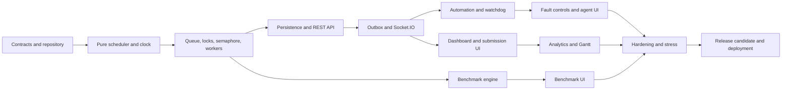

# Smart Printer Queue Management System — Implementation Roadmap

## 1. Roadmap objective

This roadmap turns the approved product, architecture, design, API, agent, and test specifications into a buildable sequence. It defines what is built, when it is built, why that order is required, and the evidence needed before dependent work begins.

The recommended delivery window is **12 weeks**, from **Monday, September 21, 2026 through Friday, December 11, 2026**. The dates assume:

- two full-time software engineers who can work across frontend and backend;
- one engineer focused on domain/backend and one focused on web, with shared ownership of integration;
- a part-time product designer or design-capable frontend engineer;
- part-time QA/DevOps support, or those duties shared by the engineers;
- the project starts from the documentation-only repository currently present;
- no physical printer integration, document uploads, or additional scheduling algorithms are added during the core release.

For one developer, preserve the same phase order and plan approximately 20–24 weeks. Adding people should shorten parallelizable UI, test, and deployment work, but should not compress the scheduler/synchronization critical path without increasing regression risk.

## 2. Non-negotiable build order



The sequence is deliberate:

1. Contracts come first because every layer shares job, printer, command, error, and event shapes.
2. Scheduling functions come before Express or React so correctness is tested without transport concerns.
3. Locks, bounded-buffer behavior, and workers come before persistence because they define authoritative state transitions.
4. REST comes before Socket.IO because commands and snapshot reads must work without live delivery.
5. The outbox comes before the live UI so events represent committed state, not optimistic server memory.
6. The dashboard comes before analytics; analytics requires trustworthy event history.
7. Benchmarks reuse the proven scheduler but remain isolated from live state.
8. Fault injection and watchdog recovery are built only after normal completion and cancellation are reliable.
9. Performance, security, and deployment hardening happen throughout, with a dedicated release gate after feature completion.

## 3. Milestones

| Milestone | Target date | Outcome | Release decision |
|---|---:|---|---|
| M0 — Contracts frozen for implementation | Sep 25 | repository, schemas, CI, reference fixtures | engineering may build against v1 contracts |
| M1 — Domain engine proven | Oct 9 | schedulers, locks, workers, cancellation pass deterministically | API integration may begin |
| M2 — Backend alpha | Oct 23 | persistent REST commands, snapshot, outbox, Socket events | web may integrate with live backend |
| M3 — Recovery-complete backend | Oct 30 | agents, paper jam, watchdog, fencing, metrics | fault UI and full E2E begin |
| M4 — Usable product beta | Nov 13 | dashboard, submission, burst, controls, reconnect | instructor usability testing begins |
| M5 — Feature complete | Nov 27 | analytics and benchmark pages complete | scope freezes; only defects/docs remain |
| M6 — Release candidate | Dec 4 | security, accessibility, stress, restore, deployment pass | go/no-go review |
| M7 — v1 demonstration release | Dec 11 | deployed, rehearsed, observable, recoverable release | project accepted |

## 4. Workstreams and ownership

| Workstream | Primary owner | Responsibilities |
|---|---|---|
| Domain engine | Backend/domain engineer | scheduler, clock, queue coordinator, locks, workers, invariants |
| API and persistence | Backend/domain engineer | Express, Prisma, PostgreSQL/SQLite, commands, queries, outbox |
| Real-time and agents | Backend owner with frontend reviewer | Socket.IO, replay/resync, automation, watchdog, metrics |
| Web experience | Frontend engineer | App Router, Shadcn UI, forms, live reducer, dashboard, charts |
| Contracts | Shared | Zod schemas, inferred types, fixtures, API/event compatibility |
| Quality | Shared, QA lead if available | automated tests, stress, accessibility, E2E, trace artifacts |
| Delivery | Shared, DevOps lead if available | Docker, migrations, CI/CD, health, logging, rollback |

No feature is considered “backend complete” until its contract and automated tests exist. No page is considered “frontend complete” until loading, empty, stale, disconnected, forbidden, validation, and success states are handled.

## 5. Week-by-week delivery plan

## Week 1 — Foundation and executable contracts

**Dates:** September 21–25, 2026  
**Goal:** create a reproducible monorepo and make shared schemas the first executable code.

### Build in this order

1. Create the pnpm workspace, root scripts, strict TypeScript configuration, ESLint, Prettier, and Vitest.
2. Scaffold `apps/web`, `apps/api`, `packages/contracts`, `packages/config`, and `packages/test-fixtures` exactly as described in `TECH_STACK.md`.
3. Add environment validation and checked-in `.env.example` files without secrets.
4. Implement Zod schemas and inferred types for jobs, printers, scheduler configuration, simulation state, API envelopes, errors, commands, and Socket envelopes.
5. Create deterministic reference workloads for FCFS, SJF, Priority Aging, cancellation, printer compatibility, and simultaneous arrivals.
6. Add CI for install, formatting, lint, type checking, unit tests, and production builds.
7. Scaffold Express health endpoints and a minimal Next.js application shell solely to prove builds and service connectivity.

### Deliverables

- Workspace installs from a clean checkout with `pnpm install --frozen-lockfile`.
- Shared contracts compile without importing React, Express, Prisma, or Socket.IO.
- `/health/live` and `/health/ready` have typed responses.
- Web app displays environment and API readiness without domain behavior.
- CI blocks contract/type/test failures.

### Exit gate M0

- All external payloads documented in `API_AND_EVENTS.md` have a v1 schema or an explicitly scheduled schema task.
- Strict type checking, lint, unit test command, and production builds pass.
- Reference fixtures are reviewed for correct expected order and metrics.
- No UI behavior relies on handwritten duplicate domain types.

## Week 2 — Pure scheduling engine and simulation clock

**Dates:** September 28–October 2, 2026  
**Goal:** prove deterministic scheduling and time calculations without HTTP, database, timers, or UI.

### Build in this order

1. Implement immutable domain entities and legal lifecycle-transition rules.
2. Implement the monotonic simulation clock with pause, resume, speed multiplier, and manual advancement for tests.
3. Implement stable FCFS using arrival time and sequence.
4. Implement non-preemptive SJF using predicted remaining service time and compatible printer speed.
5. Implement non-preemptive Priority with Dynamic Aging using the exact documented formula and cap.
6. Return structured scheduler explanations with every selection.
7. Implement pure wait, response, service, turnaround, throughput, fairness, and utilization calculations.
8. Run reference and edge-case tests from `SCH-001` through `SCH-022`.

### Deliverables

- Pure scheduler module with no framework or persistence dependencies.
- Fake/manual clock used by every time-sensitive test.
- Golden workload results for all algorithms.
- Performance measurement for selecting from 10,000 jobs.

### Exit gate

- All scheduler matrix tests pass deterministically across repeated runs.
- Base priority never mutates during aging.
- Pausing the clock freezes derived waits and watchdog durations.
- Running jobs remain unaffected by a scheduler switch.

## Week 3 — Synchronization, bounded queue, and printer workers

**Dates:** October 5–9, 2026  
**Goal:** establish the authoritative in-memory operating-system simulation.

### Build in this order

1. Implement `FairMutex` with FIFO waiters, bounded acquisition, owner token, and `runExclusive`.
2. Implement `BinaryLeaseMutex` with lease renewal, expiry, and fencing token.
3. Implement `CountingSemaphore` with bounded permits and inspection state.
4. Implement `BoundedBuffer` with atomic single, atomic burst, and explicit partial burst modes.
5. Implement Queue Coordinator commands and state-version checks.
6. Implement printer worker loops that commit progress only at page boundaries.
7. Implement normal dispatch, completion, queued cancellation, active cancellation after current page, and printer compatibility blocking.
8. Add invariant assertions and controlled-interleaving tests `SYN-001` through `SYN-018`.
9. Add an in-process demonstration harness: submit jobs, run two printers, print lifecycle events, cancel one job, and finish cleanly.

### Deliverables

- Concurrent multi-printer domain simulation without network or database.
- Inspectable queue/printer mutex and semaphore state.
- Central lifecycle transition and invariant enforcement.
- Runnable deterministic domain demonstration.

### Exit gate M1

- Zero duplicate assignments or overlapping jobs per printer under stress.
- Buffer never exceeds capacity.
- Cancellation/completion races produce exactly one terminal state.
- Every acquisition releases on failure.
- Lock-order instrumentation finds no `printer -> queue` inversion.
- The demonstration completes with correct metrics and no leaked locks/permits.

## Week 4 — Persistence and REST command/query API

**Dates:** October 12–16, 2026  
**Goal:** make domain behavior durable and accessible through validated HTTP.

### Build in this order

1. Define Prisma models and initial migration for simulations, jobs, printers, scheduler configuration, domain events, audit entries, idempotency keys, snapshots, and benchmarks.
2. Implement repository adapters and database transaction boundary.
3. Persist state changes, audit records, and outbox entries as one logical transaction.
4. Restore the latest snapshot plus event tail on startup; invalidate previous worker leases.
5. Add Express middleware in the documented order: IDs, security headers, size limits, authentication stub/adapter, rate limits, validation, authorization, error mapping, logging.
6. Implement state, job, printer, scheduler, metrics, and health routes.
7. Implement version conflicts, idempotency, pagination, capacity errors, and error envelopes.
8. Add Supertest coverage for success, validation, authorization, conflict, idempotency, and persistence failure.

### Deliverables

- REST API supports the full normal job lifecycle.
- SQLite local mode and PostgreSQL development mode use the same migrations.
- Restart recovery resumes from the last committed page boundary.
- OpenAPI output is generated from or checked against executable schemas if enabled.

### Exit gate

- A database failure cannot produce a successful mutation or advance in-memory state.
- Repeating an idempotent command returns the original result.
- API tests cover every currently implemented error branch.
- A process restart preserves terminal history and safely recovers nonterminal jobs.

## Week 5 — Transactional event outbox and Socket.IO

**Dates:** October 19–23, 2026  
**Goal:** deliver committed state changes to clients with ordering, replay, and resynchronization.

### Build in this order

1. Implement outbox dispatcher with retry and delivered-at tracking.
2. Add authenticated Socket.IO namespace, simulation rooms, and authorization.
3. Emit the canonical event envelope with `stateVersion`, `eventIndex`, `eventId`, correlation ID, and simulation time.
4. Implement subscription with last-seen tuple, bounded replay, and `RESYNC_REQUIRED` fallback.
5. Implement progress coalescing without dropping lifecycle, lock, alert, or terminal events.
6. Build the browser Socket provider and idempotent live-state reducer.
7. Seed the reducer from `GET /state`; stop reduction and fetch a fresh snapshot on a version gap.
8. Add integration tests `SOC-001` through `SOC-012`.

### Deliverables

- REST commands produce durable events visible in an authenticated browser client.
- Reconnect supports replay when retained and snapshot replacement otherwise.
- Slow clients receive current progress and every critical event.

### Exit gate M2

- Submit, dispatch, progress, completion, and cancellation converge in the test client.
- Duplicate delivery produces no duplicate UI/domain change.
- Room-isolation tests prove no cross-simulation leak.
- Restarting the Socket dispatcher drains committed undelivered outbox rows.

## Week 6 — Automation, load balancing, faults, watchdog, and metrics

**Dates:** October 26–30, 2026  
**Goal:** complete automated operation and safe failure recovery before exposing fault controls in the UI.

### Build in this order

1. Implement Automation Daemon tick, bounded per-printer command issuance, pause handling, and circuit breaker.
2. Implement deterministic compatible-printer scoring and reservations in the Load Balancer.
3. Implement paper-jam and worker-stall injection behind the environment/role gate.
4. Implement printer recovery with retained committed pages.
5. Implement worker heartbeats, missed-progress detection, fencing, forced release, retry count, and terminal retry exhaustion.
6. Implement Starvation Guard warning/clear behavior.
7. Implement rolling Metrics Evaluator outside the scheduling critical path.
8. Expose agent state, alerts, fault/recovery routes, and events.
9. Run `AGT-001` through `AGT-015` and an accelerated recovery scenario.

### Deliverables

- Normal automation advances jobs without manual dispatch.
- Jam and recovery preserve invariants.
- Watchdog rejects stale worker updates after fencing.
- Agent circuits and alerts are observable and auditable.

### Exit gate M3

- Two missed progress windows precede interception.
- A forced release is impossible before successful fencing.
- Three stalls result in one terminal failure with the documented code.
- Metrics failures do not stop dispatch.
- The end-to-end backend scenario completes jobs after one injected jam.

## Week 7 — Web shell, authentication experience, submission, and burst generation

**Dates:** November 2–6, 2026  
**Goal:** deliver the first complete user workflow against the live backend.

### Build in this order

1. Implement application shell, navigation, header, theme tokens, connection indicator, simulation clock, and global status banners.
2. Integrate identity/role-aware controls; unauthorized actions are absent or disabled with explanation.
3. Implement single-job form with shared schema, accessible validation summary, and idempotency key.
4. Implement deterministic burst controls and local preview using the contract's generation model.
5. Implement queue capacity meter and atomic/partial mode explanation.
6. Implement success, partial acceptance, capacity, rate limit, disconnected, and stale-state behavior.
7. Add component tests and the first Playwright flow from submission through completion.

### Deliverables

- User can authenticate, submit one job, generate/preview/enqueue a burst, and observe server acknowledgement.
- Mobile and desktop navigation work from 360 px upward.
- Form controls meet keyboard, label, focus, and error requirements.

### Exit gate

- A new user can submit a job within two minutes.
- Double-clicking or retrying submission creates one job.
- Burst preview is deterministic and does not mutate live state.
- Core form and navigation accessibility tests pass.

## Week 8 — Main live control dashboard

**Dates:** November 9–13, 2026  
**Goal:** make the live system understandable and operable from one screen.

### Build in this order

1. Implement KPI strip with sampling-window labels.
2. Implement live queue with rank, status, remaining pages, wait, priorities, and scheduler explanation.
3. Implement printer fleet cards with progress, capabilities, active job, mutex summary, and operator actions.
4. Implement Job Inspector and lock inspection panels.
5. Implement event stream with type filters and correlation ID support.
6. Implement agent health, circuit, watchdog threshold, and alerts.
7. Implement jam/recover/offline confirmations and command-pending states.
8. Optimize event batching and queue rendering at 1,000 jobs.
9. Test offline, stale, resync, empty, no-printer, full-queue, and error states.

### Deliverables

- Dashboard reflects all normal and fault lifecycle events without refresh.
- Operator can pause/resume, change speed, jam/recover a printer, and inspect resulting events.
- Viewer has read-only behavior with no privileged command path.

### Exit gate M4

- Live state converges within 500 ms p95 on the local reference environment.
- A version gap causes visible stale state and atomic resync before commands re-enable.
- Queue remains responsive at 1,000 jobs.
- Instructor usability review can complete the core demonstration without developer assistance.

## Week 9 — Real-time analytics and Gantt visualization

**Dates:** November 16–20, 2026  
**Goal:** convert the trusted event history into OS-focused visual explanations.

### Build in this order

1. Implement timeline query/view models for execution, idle, jam, offline, queue depth, and mutex intervals.
2. Implement shared simulation-time axis and visible-range filtering.
3. Build printer-lane Gantt with synchronized selection and accessible table alternative.
4. Build queue-depth chart, wait/turnaround summaries, mutex timeline, and process-state panel.
5. Add follow-live, pause inspection, zoom, pan, and filters.
6. Add reduced-motion behavior and keyboard chart navigation.
7. Validate computed metrics against reference workloads and API values.

### Deliverables

- A selected job is synchronized across Gantt, process state, metrics, and queue context.
- Jam and idle intervals are visually distinct and textually described.
- Charts remain usable without hover, color perception, or motion.

### Exit gate

- Gantt intervals exactly match committed job/printer events.
- Table alternatives expose equivalent values.
- Large-history queries use bounded windows and do not block live updates.
- Reference workload calculations match scheduler/metrics unit fixtures.

## Week 10 — Algorithm benchmark engine and matrix

**Dates:** November 23–27, 2026  
**Goal:** deliver reproducible, live-state-isolated algorithm comparison.

### Build in this order

1. Implement normalized immutable workload snapshots and SHA-based workload hash.
2. Implement the benchmark runner by reusing the proven pure schedulers and simulation clock.
3. Add workload/printer/config limits and cancellation/timeouts.
4. Persist benchmark metadata and results without changing active simulation state/version.
5. Implement benchmark REST endpoints and `benchmark.completed` event.
6. Build workload selector/configurator and algorithm selection.
7. Build metric matrix, shared-scale Gantt small multiples, rank-change table, and factual trade-off summary.
8. Implement JSON and CSV export.
9. Test identical seeds/configurations, workload isolation, and 10,000-job upper bound.

### Deliverables

- FCFS, SJF, and Priority Aging compare against one immutable workload.
- Results include seed, workload hash, engine version, exact configuration, metrics, and Gantt intervals.
- Live queue and state version are unchanged by benchmark execution.

### Exit gate M5

- Repeated benchmark runs are byte-equivalent after excluding generated IDs/timestamps.
- Exported metrics equal displayed metrics.
- Maximum supported benchmark finishes within the recorded budget.
- Product scope freezes after this gate; new features move to a later release.

## Week 11 — Security, accessibility, reliability, and performance hardening

**Dates:** November 30–December 4, 2026  
**Goal:** turn the feature-complete build into a release candidate.

### Build in this order

1. Run the entire unit, domain integration, HTTP, Socket, component, and E2E matrices.
2. Execute concurrent burst, 64-worker, reconnect, outbox restart, and 30-minute accelerated soak tests.
3. Complete authentication, role, CSRF, CORS, security headers, payload limits, and rate-limit verification.
4. Perform dependency/license/vulnerability scan and remove unused dependencies.
5. Run automated and manual keyboard/screen-reader/contrast/reduced-motion checks.
6. Profile API scheduling, Socket delivery, queue rendering, and chart windows against targets.
7. Test database backup/restore, snapshot recovery, migration from the previous schema, and rollback compatibility.
8. Fix release-blocking defects; freeze contract changes except corrective changes with coordinated clients.

### Deliverables

- Test, performance, accessibility, and security evidence attached to the candidate build.
- Known issues list contains only accepted non-blocking limitations.
- Deployment runbook, dashboards, and alerts are executable.

### Exit gate M6

- Zero open critical/high security defects.
- Zero invariant, deadlock, data-loss, authorization, or cross-simulation isolation failures.
- All release acceptance flows pass from a clean environment.
- p95 performance and convergence targets pass on recorded reference hardware.
- Backup restoration and application rollback have been rehearsed.

## Week 12 — Deployment, demonstration rehearsal, and release

**Dates:** December 7–11, 2026  
**Goal:** deploy a recoverable v1 and prove it through the intended demonstration.

### Build and release order

1. Build immutable production images and publish them with commit/version labels.
2. Provision production secrets, PostgreSQL, ingress/TLS, observability, retention, backups, and exact origin/proxy settings.
3. Run migration as a single release job.
4. Deploy API and verify readiness, persistence, coordinator ownership, and outbox.
5. Deploy web and verify server/browser API and Socket URLs.
6. Run production smoke: authenticate, submit, concurrent dispatch, progress, completion, metrics, reconnect.
7. Run demonstration rehearsal: seeded burst, algorithm explanation, paper jam, watchdog recovery, analytics, benchmark comparison, export.
8. Observe a soak window; verify logs, metrics, alerts, backups, and no leaked locks/outbox growth.
9. Hold go/no-go review and tag v1 only after all release criteria pass.

### Release deliverables

- Versioned images, migration record, deployment manifest, and release notes.
- Demonstration seed and script with expected results.
- Operations owner, rollback owner, incident contacts, and post-release observation window.
- Archived test evidence and known-limitations list.

### Exit gate M7

- Production smoke and demonstration run complete without manual database/state repair.
- Monitoring receives a synthetic failure and recovery signal.
- Rollback target remains available and compatible.
- The deployed contract/version matches the documentation.

## 6. Parallelization rules

Safe parallel work:

- Week 1 web shell can proceed while backend contracts are implemented, but both consume the same schemas.
- During Weeks 2–3, the frontend may build static components against reviewed fixtures; it must not invent event fields or scheduler behavior.
- During Week 4, the frontend can implement forms and empty/loading states against a generated/mock contract client.
- During Week 6, dashboard composition can begin using real Week 5 events while backend agents are completed.
- Analytics query/view-model work and benchmark UI composition can overlap after their respective backend result shapes are frozen.
- Deployment automation and accessibility checks begin early and are finalized in Week 11.

Do not parallelize across these boundaries:

- Do not implement an alternative scheduler in the frontend.
- Do not build Socket emission before committed domain events/outbox exist.
- Do not implement watchdog forced release before leases and fencing are proven.
- Do not calculate analytics independently in the browser when authoritative metrics exist.
- Do not add benchmark-specific scheduling logic; reuse the production scheduler functions.

## 7. Critical path and slack

The critical path is:

```text
contracts → scheduler → synchronization/workers → persistence/API
→ outbox/Socket → watchdog → integrated dashboard → hardening → release
```

Analytics and benchmark presentation have roughly one week of schedule flexibility if their backend inputs are complete, but both are required for M5. The roadmap reserves most of Week 11 for stabilization rather than feature development. If an earlier phase slips, protect Week 11 by reducing nonessential visual polish—not invariant tests, recovery, validation, accessibility basics, or deployment safety.

## 8. Priority backlog

### P0 — required for v1

- Shared schemas and strict types.
- FCFS, SJF, Priority Aging and exact tie-breakers.
- Simulation clock, bounded buffer, locks, semaphore, workers, invariants.
- Normal submission, burst, cancellation, completion, and blocked compatibility.
- Persistence, audit, idempotency, state versions, snapshots, restart recovery.
- Socket ordering, deduplication, replay/resync, outbox.
- Automation, paper jam, recovery, fencing, watchdog retry/circuit behavior.
- Dashboard, submission, analytics, benchmark matrix, role-aware controls.
- Security, accessibility, stress tests, Docker, health, backups, rollback.

### P1 — include only after P0 gates remain green

- Saved workload library beyond the current snapshot and generator.
- Rich event filtering and downloadable audit reports.
- Additional chart annotations and comparison narrative.
- PostgreSQL production tuning beyond measured needs.

### P2 — post-v1

- Round Robin or other preemptive scheduling.
- Multi-simulation administration UI.
- Distributed simulation ownership and horizontally scaled coordinators.
- Physical printer protocols, document storage, native mobile clients, or AI-generated scheduling decisions.

P1 work must not displace Week 11 hardening. P2 work requires a separate architecture and scope decision.

## 9. Definition of ready

A work item may enter implementation only when:

- its user-visible or domain outcome is clear;
- request, response, command, event, and error contracts are identified;
- dependencies and affected invariants are named;
- acceptance tests and permission requirements are written;
- loading, empty, failure, retry, and disconnected behavior are defined where applicable;
- the design does not conflict with `ARCHITECTURE.MD`, `API_AND_EVENTS.md`, or the current contract version.

## 10. Definition of done

A work item is done only when:

- implementation is merged with no placeholder branch or disabled validation;
- relevant unit/integration/component/E2E tests pass;
- domain invariants run for state-changing behavior;
- schemas and documentation match actual payloads;
- authorization, audit, idempotency, and error behavior are covered when applicable;
- accessibility states are verified for UI work;
- structured logging and relevant metrics exist;
- a clean production build succeeds;
- no unrelated P0 regression is introduced.

“Works on the happy path” is not done for synchronization, recovery, persistence, or security work.

## 11. Weekly operating cadence

### Monday

- Review the previous gate and current critical path.
- Select only items that meet Definition of Ready.
- Confirm contract changes before separate frontend/backend work begins.

### Daily

- Integrate to the main development branch in small reviewed changes.
- Run impacted tests before handoff.
- Record newly discovered risks, contract decisions, and failing seeds.

### Wednesday integration checkpoint

- Run the current vertical slice from client or harness through persistence and events.
- Resolve integration drift before adding more features.

### Friday gate review

- Demonstrate the week's outcome using deterministic fixtures.
- Review automated evidence, not only a manual demonstration.
- Mark the gate pass/fail and update the next week's scope.
- A failed gate carries unfinished required work forward before new dependent work starts.

## 12. Risk register and response triggers

| Risk | Early signal | Prevention | Required response |
|---|---|---|---|
| Scheduler/API contract drift | duplicate types or mapping code | contracts package first | stop feature work; reconcile schema and fixtures |
| Race or leaked lock | intermittent hang, permit mismatch | fake clock, controlled interleavings, invariants | block milestone; retain seed/event trace; fix root cause |
| UI built on guessed behavior | mock fields not in schemas | generated clients and reviewed fixtures | replace mock contract before integration proceeds |
| Socket inconsistency | duplicate rows, version gaps | outbox, event IDs, state tuple | disable mutation UI during resync; fix ordering |
| Watchdog corrupts active work | force release without fence | explicit lease/fence gate | disable recovery action until fencing tests pass |
| Persistence/state divergence | restart differs from pre-restart | transaction and replay tests | block release; restore from verified snapshot/event tail |
| Chart performance | frame drops with large history | bounded time windows and normalized models | reduce rendered range, not event fidelity |
| Scope expansion | new algorithms/devices before M5 | P0/P1/P2 policy | move request to post-v1 unless it replaces approved scope |
| Security delayed | auth mocked after integration | middleware/roles in Week 4 | do not expose deployment; finish authorization first |
| No stabilization time | features enter Week 11 | feature freeze at M5 | cut P1 polish; preserve hardening week |

## 13. Go/no-go release checklist

### Product

- A first-time user can submit and observe a job.
- An instructor can demonstrate all three schedulers and aging.
- Fault injection, watchdog recovery, analytics, and benchmark comparison work end to end.
- UI identifies the system as a simulation and never claims physical printing.

### Correctness

- Scheduler reference suite passes.
- Mutex, semaphore, capacity, cancellation, and terminal-state invariants pass under stress.
- Late fenced-worker updates cannot commit.
- Restart recovery preserves committed pages and emits no duplicate terminal transition.

### Protocol

- REST and Socket payloads validate against v1 schemas.
- Idempotency, ordering, deduplication, replay, and full resync pass.
- Cross-simulation and role isolation pass.

### Quality

- Required tests and production builds pass from a clean checkout.
- Performance targets, accessibility core workflows, and security review pass.
- No critical/high defect remains; accepted lower issues are documented with impact.

### Operations

- Migrations, backup/restore, health checks, alerts, and rollback are rehearsed.
- Secrets and exact origin/proxy settings are production-safe.
- One authoritative coordinator per simulation is guaranteed.
- Release and demonstration owners know the recovery procedure.

If any correctness, security, data recovery, or coordinator-ownership item fails, the decision is **no-go**. Visual polish defects may be accepted only when they do not impair comprehension, accessibility, or the core demonstration.

## 14. First implementation action

The first code change should be the Week 1 workspace and `packages/contracts` setup. Do not begin with dashboard components or a database schema in isolation. The first merge should leave one reproducible command that installs, type-checks, tests the initial schemas, and builds both application shells; that is the base every later phase depends on.
